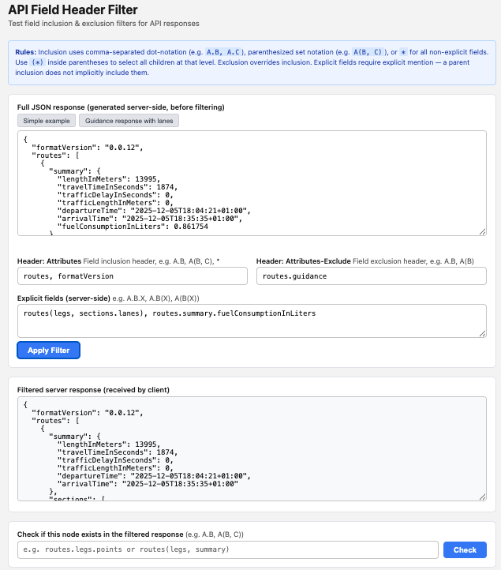

# API Field Header Filter

A TypeScript utility for filtering JSON API responses based on field inclusion and exclusion
headers, implementing the API Response Field Selection mechanism.

## Overview

This library provides a `FieldFilter` class that filters JSON objects based on:

- **Field inclusion** (`Attributes` HTTP header) — specifies which fields to return
- **Field exclusion** (`Attributes-Excluded` HTTP header) — specifies which fields to omit
- **EXPLICIT fields** — fields that must be explicitly requested (not returned by default)

The filtering rules are designed for use in HTTP APIs where clients can control which fields
are returned in responses, reducing bandwidth and improving performance.

## Rules

1. Any field in the inclusion list (and its sub-tree) is returned in the response.
2. Fields marked as **EXPLICIT** must be explicitly named in the inclusion list — including a
   parent does not implicitly include them.
3. Any field in the exclusion list is removed from the response, regardless of the inclusion list.

For the full design specification, see [docs/plans/design.md](docs/plans/design.md).

## Installation

```bash
npm install
```

## Usage

### As a Library

```typescript
import { FieldFilter } from "./src/FieldFilter"

const filter = new FieldFilter({
  include: "name, address.city",       // Attributes header value
  exclude: "address.city.zipCode",     // Attributes-Excluded header value
  explicitFields: ["metadata.debug"],  // Fields marked EXPLICIT in API docs
})

const input = {
  name: "Alice",
  address: {
    city: { name: "Amsterdam", zipCode: "1000AA" },
    country: "NL",
  },
  metadata: {
    debug: { traceId: "abc123" },
  },
}

const result = filter.apply(input)
// {
//   name: "Alice",
//   address: {
//     city: { name: "Amsterdam" }
//   }
// }
```

### Interactive Web App

A sample web application is included for testing the filter interactively:

```bash
npm run dev
```

Open [http://localhost:5173](http://localhost:5173) to use the app. It provides input fields for:

- **JSON Input** — the full JSON object to filter
- **Field Inclusion** — comma-separated dot-notation paths
- **Field Exclusion** — comma-separated dot-notation paths
- **Explicit Fields** — one dot-notation path per line



## Development

### Build

```bash
npm run build
```

### Run Tests

```bash
npm test
```

### Run Tests in Watch Mode

```bash
npm run test:watch
```

## License

Copyright (C) 2026, TomTom NV. Licensed under the [Apache License, Version 2.0](LICENSE.md).
